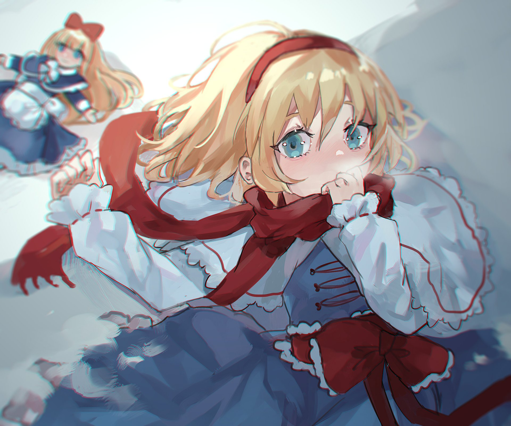
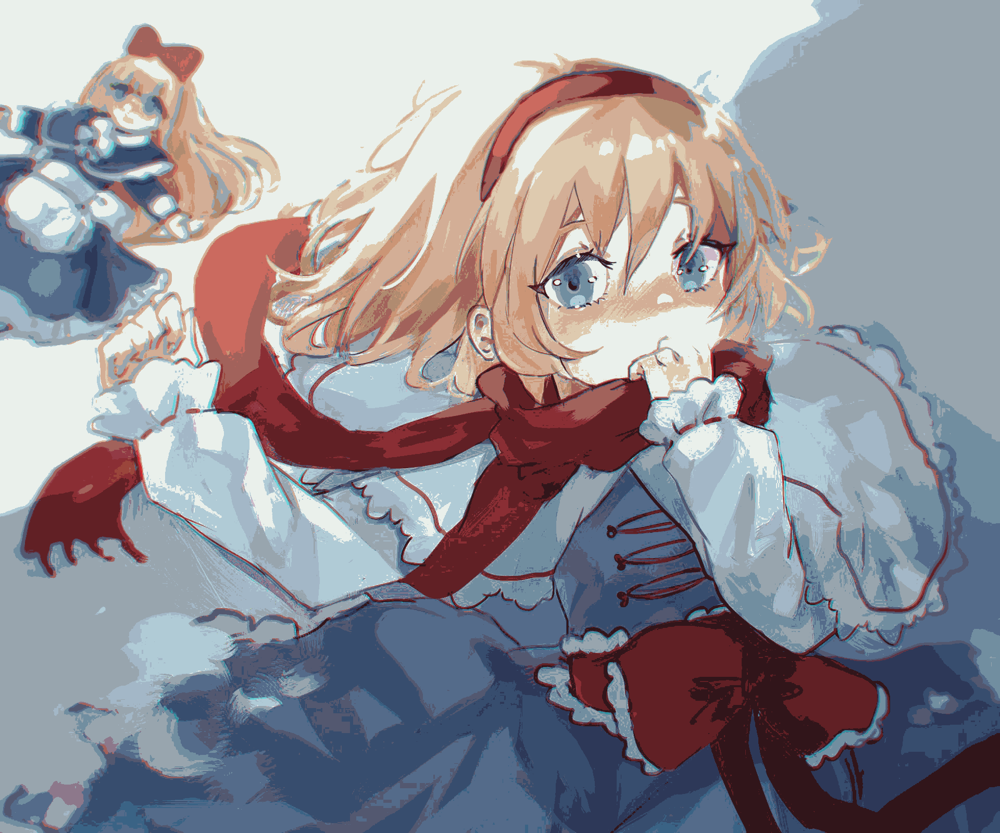
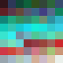

# Octree Color Quantizer

This project implements an octree-based color quantization algorithm in Go to reduce the number of colors in an image while preserving visual quality. The octree color quantizer helps create a palette of colors from an input image and then maps the colors in the image to this palette, which can be useful for tasks like image compression and color reduction.

## Features

- **Color Quantization**: Reduces the number of colors in an image using an octree-based quantization algorithm.
- **Palette Generation**: Generates a color palette with a specified number of colors.
- **Image Conversion**: Converts an input image to use the generated palette.
- **Palette Visualization**: Creates and saves an image showing the generated color palette.

## Code Overview

### Usage

```go
func main() {
    // Load the image
    file, err := os.Open("input.png")
    if err != nil {
        fmt.Println("Error opening image:", err)
        return
    }
    defer file.Close()

    img, err := png.Decode(file)
    if err != nil {
        fmt.Println("Error decoding image:", err)
        return
    }

    // Create an OctreeQuantizer
    quantizer := NewOctreeQuantizer()

    // Add colors from the image to the quantizer
    bounds := img.Bounds()
    for y := bounds.Min.Y; y < bounds.Max.Y; y++ {
        for x := bounds.Min.X; x < bounds.Max.X; x++ {
            r, g, b, _ := img.At(x, y).RGBA()
            color := Color{
                Red:   int(r >> 8),
                Green: int(g >> 8),
                Blue:  int(b >> 8),
            }
            quantizer.AddColor(color)
        }
    }

    // Generate the color palette
    colorCount := 64 // Number of colors in the palette
    palette := quantizer.MakePalette(colorCount)

    // Create a new image with the quantized colors
    quantizedImg := image.NewRGBA(bounds)
    for y := bounds.Min.Y; y < bounds.Max.Y; y++ {
        for x := bounds.Min.X; x < bounds.Max.X; x++ {
            r, g, b, _ := img.At(x, y).RGBA()
            color_palette := Color{
                Red:   int(r >> 8),
                Green: int(g >> 8),
                Blue:  int(b >> 8),
            }
            paletteIndex := quantizer.GetPaletteIndex(color_palette)
            quantizedColor := palette[paletteIndex]
            quantizedImg.Set(x, y, color.RGBA{
                R: uint8(quantizedColor.Red),
                G: uint8(quantizedColor.Green),
                B: uint8(quantizedColor.Blue),
                A: 255,
            })
        }
    }

    // Save the quantized image
    outputFile, err := os.Create("output.png")
    if err != nil {
        fmt.Println("Error creating output image:", err)
        return
    }
    defer outputFile.Close()

    err = png.Encode(outputFile, quantizedImg)
    if err != nil {
        fmt.Println("Error encoding output image:", err)
        return
    }

    fmt.Println("Quantized image saved as output.png")

// Create a palette image with larger pixels
pixelSize := 10
paletteImg := image.NewRGBA(image.Rect(0, 0, 8*pixelSize, ((colorCount+7)/8)*pixelSize))
for i, c := range palette {
    x := (i % 8) * pixelSize
    y := (i / 8) * pixelSize
    for dx := 0; dx < pixelSize; dx++ {
        for dy := 0; dy < pixelSize; dy++ {
            paletteImg.Set(x+dx, y+dy, color.RGBA{
                R: uint8(c.Red),
                G: uint8(c.Green),
                B: uint8(c.Blue),
                A: 255,
            })
        }
    }
}
    // Save the palette image
    paletteFile, err := os.Create("palette.png")
    if err != nil {
        fmt.Println("Error creating palette image:", err)
        return
    }
    defer paletteFile.Close()

    err = png.Encode(paletteFile, paletteImg)
    if err != nil {
        fmt.Println("Error encoding palette image:", err)
        return
    }

    fmt.Println("Palette image saved as palette.png")
}
```

### Key Components

- **`Color`**: Represents a color with Red, Green, and Blue components.
- **`OctreeNode`**: Represents a node in the octree. Each node can have up to 8 children.
- **`OctreeQuantizer`**: Manages the octree and provides methods to add colors, generate palettes, and get color indices.

### Functions

- **`NewColor(red, green, blue int) Color`**: Creates a new `Color` instance.
- **`NewOctreeNode(level int, parent *OctreeQuantizer) *OctreeNode`**: Creates a new `OctreeNode`.
- **`AddColor(color Color)`**: Adds a color to the quantizer.
- **`MakePalette(colorCount int) []Color`**: Generates a color palette with the specified number of colors.
- **`GetPaletteIndex(color Color) int`**: Gets the index of the color in the palette.
- 
## Example

### Original Image
The original image is located at `examples/alice`. It is 2.27MB in size.



### Quantized Image
The quantized image is located at `examples/quantized_alice`. It is 0.51MB in size and contains 64 colors.



### Quantized Palette
The palette used for the quantized image is located at `examples/quantized_palette`.



## Contributing

Feel free to submit issues, pull requests, and suggestions to improve the project.
